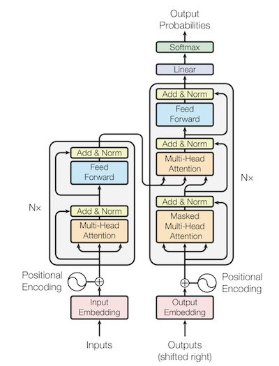

# Do it yourself GPT

GPT implementation using pytorch to understand the GPT Architecture

### Notes:

- _nn1.py_ Basic 3 Layer neural net
- _nn2.py_ Optimizer Adam, Extract Model
- _nn3.py_ Text Encoding/ Decoding
- _nn4.py_ Embeddings
- _nn5.py_ Attention Head
- _nn6.py_ Add Self Attention
- _main.py_ Using Reweight
- _gpt.py_ GPT Model Karpathy

### Terms:

- SGD = Stochastic Gradient Descent
- ADAM = Adaptive Moment Estimation
- MSE = Mean Squared Error
- RELU = Rectified linear activation unit
- Masked Self Attention: Only look on items before you

### Papers:

[GPT-3 Paper, 2015](https://arxiv.org/pdf/2005.14165.pdf)

[Attention is all you need (GPT Architecture, 2017](https://arxiv.org/pdf/1706.03762.pdf)

[The annotated transformer](http://nlp.seas.harvard.edu/annotated-transformer)

### References:

[GPT Source from Andrey Karpathy](https://raw.githubusercontent.com/karpathy/ng-video-lecture/master/gpt.py)

[Nano GPT](https://github.com/karpathy/nanoGPT)

### Videos:

[From Zero To GPT & Beyond - Fast Paced Beginner Friendly Tutorial On Neural Networks](https://www.youtube.com/watch?v=l-CjXFmcVzY)

[Let's build GPT: from scratch, in code, spelled out.](https://www.youtube.com/watch?v=kCc8FmEb1nY)

[How do transformers work? (Attention is all you need)](https://youtu.be/n9sLZPLOxG8)
